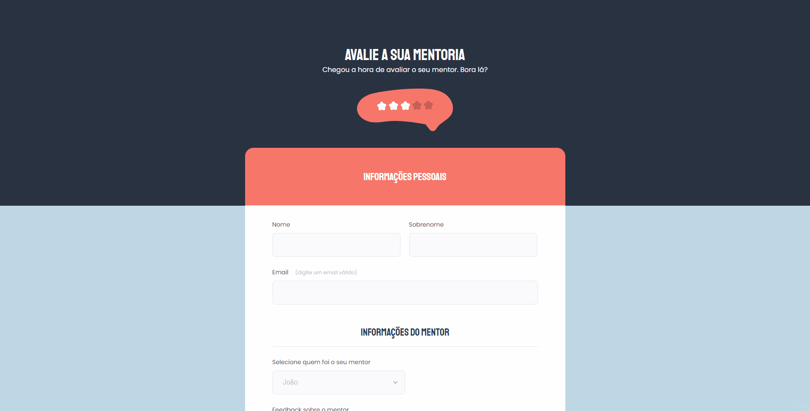
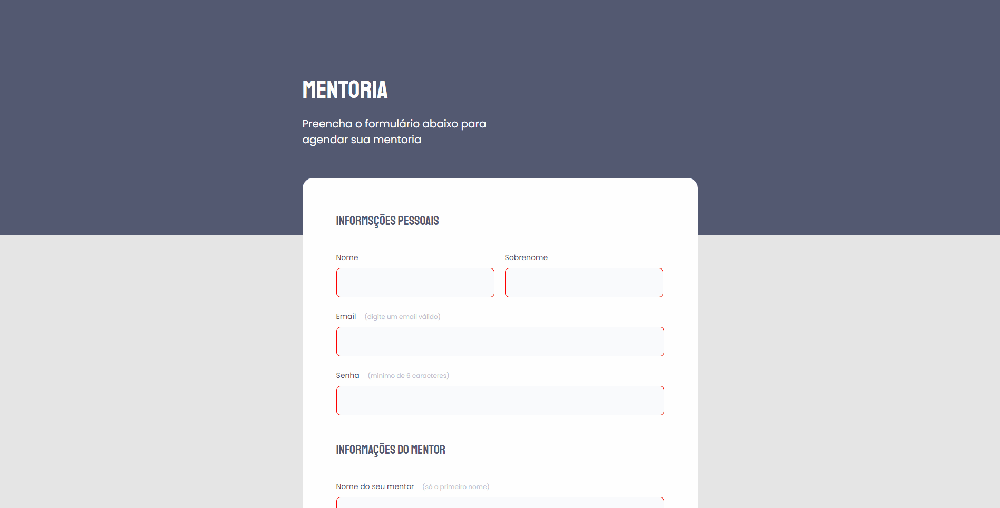

    <h1>Desafio 1 formulários - Semana 3 </h1>

 

# Sobre o desafio

 Desafio concluido - Foram recebidos dois layouts de formulários no figma, para que fossem transformados em código. 

 

# Resolução do problema

* Códigos foram criados a partir dos  layout do figma respeitando todas as suas especificações o mais fielmente possivel.

# Features 
- [x]  Layout do Desafio 1 da terceira semana do Programa Explorer

 

# DEMO 

<h1 align="center">
    
    
</h1>